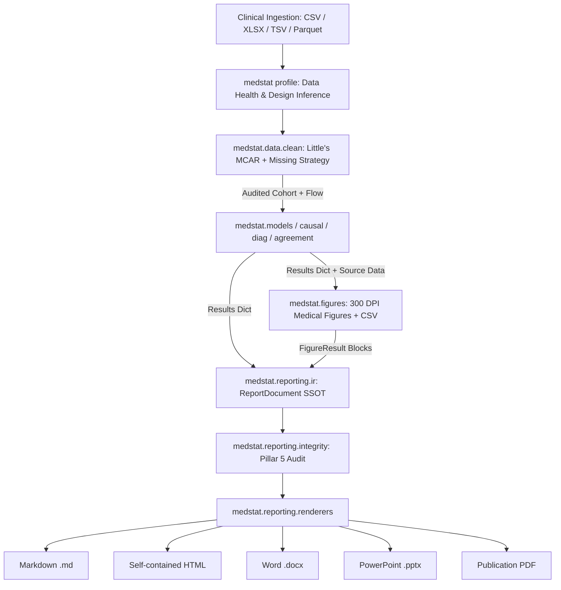

# ARCHITECTURE.md — System Architecture & Structural Diary

System architecture and structural specifications for `medstat-core` and the `medstat` CLI in `shinystat-skills`.

## 1. High-Level Architecture Overview

`medstat` is a headless, production-ready biostatistical computation engine and CLI application designed for offline-first clinical research, electronic health records (EHR) analytics, and automated biomedical manuscript preparation.

```
                          ┌───────────────────────────┐
                          │      shinystat Skill      │
                          │ (Autonomous Decision Agent│
                          │   + Grilling Gate)        │
                          └─────────────┬─────────────┘
                                        │ adapts & writes
                                        ▼
                          ┌───────────────────────────┐
                          │  Custom Python Scripts &  │
                          │     medstat CLI / SAP     │
                          └─────────────┬─────────────┘
                                        │ executes
                                        ▼
      ┌─────────────────────────────────┴─────────────────────────────────┐
      │                      Core Calculation Modules                     │
      ├───────────────────┬───────────────────┬───────────────────────────┤
      │  medstat.data     │  medstat.models   │  medstat.diagnostic       │
      │  - clean          │  - glm / firth    │  - 2x2 contingency        │
      │  - missing (MICE) │  - survival (cox) │  - ROC & DeLong CIs       │
      │  - retention flow │  - splines (RCS)  │  - DCA net benefit        │
      ├───────────────────┼───────────────────┼───────────────────────────┤
      │  medstat.causal   │  medstat.meta     │  medstat.reporting        │
      │  - psm matching   │  - DL random-eff  │  - NEJM / JAMA / APA 7    │
      │  - balance & SMD  │  - forest data    │  - STROBE/CONSORT/TRIPOD  │
      │  - love plots     │  - Egger(cont>=10)│  - methods narrative      │
      ├───────────────────┴───────────────────┴───────────────────────────┤
      │                     medstat.agreement                             │
      │  - Bland-Altman LoA with Bland–Altman (1999) large-sample CIs     │
      │  - Pure-SciPy Intraclass Correlation Coefficient (ICC) (No GPL)   │
      │  - Cohen's & Fleiss' Kappa (Categorical Inter-Rater Agreement)    │
      └───────────────────────────────────────────────────────────────────┘
```

---

## 2. Module Seams & Responsibilities

### `medstat.data`
- **`loader.py`**: Universal clinical tabular ingestion (.csv, .tsv, .xlsx, .parquet) with auto-encoding detection, whitespace stripping, and fuzzy column suggestion.
- **`clean.py`**: Missingness auditing, Little's MCAR multivariate test, Winsorization / IQR outlier handling, and strategy routing.
- **`missing.py`**: Implementation of `complete-case`, `mice` (via Bayesian ridge chained equations), `knn`, and `indicator` methods. Raises `MissingStrategyRequiredError` if missing data exists without an explicit strategy and documented justification.
- **`retention.py`**: `SampleFlowTracker` recording participant retention ($N_{\text{initial}} \to N_{\text{excluded}} \to N_{\text{analyzed}}$) with categorized reasons.

### `medstat.models`
- **`glm.py`**: OLS linear regression and standard binary logistic regression via `statsmodels`.
- **`firth.py`**: Firth penalized logistic regression and penalized Cox proportional hazards via `firthmodels` with profile likelihood confidence intervals.
- **`survival.py`**: Cox proportional hazards modeling via `lifelines` and Grambsch-Therneau Schoenfeld residual correlation tests.
- **`splines.py`**: Restricted cubic splines (RCS) with flexible knot placement via pure-Python `rcs_lib.py` for both Cox proportional hazards and multivariable logistic regression.
- **`sensitivity.py`**: VanderWeele & Ding E-value computation for point estimates and lower/upper confidence bounds.
- **`ordinal.py`**: Proportional odds logistic regression via `OrderedModel`, Brant's Wald test (Brant 1990) for parallel lines assumption, positional boolean masking, and multinomial logistic fallback.
- **`multilevel.py`**: Clustered data analysis via population-averaged Generalized Estimating Equations (GEE) with robust sandwich standard errors, random-intercept mixed models via direct design matrices (`sm.MixedLM`), cluster design effect (DEFF / ICC_cluster) calculation with numeric outcome verification, and strict covariate missingness detection.
- **`__init__.py`**: Public exports including `extract_primary_effect` for polymorphic extraction of effect estimates across GLM, Firth, Cox, and GEE models.

### `medstat.diagnostic`
- **`accuracy.py`**: Complete 2x2 contingency metrics (Sensitivity, Specificity, PPV, NPV, LR+, LR-, DOR) with Wilson score confidence intervals, low-is-abnormal directionality handling, and `validate_gold_standard` reference standard integrity validation.
- **`roc.py`**: Non-parametric empirical ROC curve, Youden's J cutpoint, and DeLong covariance matrix calculation for paired AUC comparisons.
- **`dca.py`**: Vickers Decision Curve Analysis calculating net benefit across threshold probabilities relative to "Treat All" and "Treat None".
- **`calibration.py`**: Model calibration assessment: Brier score (with scaled Brier), calibration slope & intercept via logistic recalibration, Integrated Calibration Index (ICI / E50 / E90 / Emax) per Austin & Steyerberg (2019), Hosmer-Lemeshow goodness-of-fit test, and Plotly calibration plot generation.

### `medstat.causal`
- **`psm.py`**: Propensity score estimation via logistic regression, 1:1 nearest neighbor matching with logit standard deviation caliper, and matched cohort extraction.
- **`balance.py`**: Standardized Mean Difference (SMD) calculation for continuous and binary variables (with zero-variance safety returning `np.nan` on differing means), and Austin 2009 Love plot data generation.
- **`mediation.py`**: Pure-Python parametric causal mediation analysis (Baron-Kenny / Imai) with quasi-Bayesian Monte Carlo confidence intervals for Average Causal Mediation Effect (ACME) and Average Direct Effect (ADE).

### `medstat.meta`
- **`models.py`**: Fixed-effects inverse variance and DerSimonian-Laird random-effects meta-analysis, Cochran's Q test, and Higgins $I^2$.
- **`forest.py`**: Forest plot structured data generation.
- **`bias.py`**: Egger's linear regression test for funnel plot asymmetry (applicable when $k \ge 10$ distinct studies with unstandardized continuous effect measures such as mean difference; SMD is not supported because its effect estimate and standard error are artifactually correlated, and it is not recommended for binary log odds ratios for the same reason).

### `medstat.agreement`
- **`bland_altman.py`**: Paired measurement difference analysis and limits of agreement with Bland–Altman (1999) large-sample approximate CIs. Supports both wide paired columns and long-format rater data.
- **`icc.py`**: Pure SciPy/NumPy two-way ANOVA decomposition computing Shrout & Fleiss (1979) forms (ICC1, ICC2, ICC3, ICC1k, ICC2k, ICC3k) with exact F-distribution confidence intervals.
- **`kappa.py`**: Cohen's Kappa (unweighted, linear, quadratic with non-null and null SEs) and Fleiss' generalized multi-rater Kappa for discrete categories.

### `medstat.figures`
- **`base.py`**: `FigureResult(png_path, alt_text, caption, source_df, csv_path)` contract and automated CSV source data export for auditability.
- **`styles.py`**: Publication styling (300 DPI, Okabe-Ito/Tol colorblind palettes, Thai typography fallback chain: `Sarabun`, `Thonburi`, `Sukhumvit Set`, `Arial`).
- **`forest.py`**: Forest plots for OR/HR/RR multivariable models and meta-analyses.
- **`survival.py`**: Stratified Kaplan-Meier survival curves with aligned Numbers at Risk table and log-rank p-value.
- **`roc.py`**: ROC curves with 45-degree chance diagonal, Youden optimal cutpoint, DeLong 95% CIs, and paired overlay.
- **`calibration.py`**: Decile calibration plots with Wilson CIs, LOESS curves, Brier score, and ICI.
- **`dca.py`**: Decision Curve Analysis with Net Benefit comparison against Treat All and Treat None.
- **`agreement.py`**: Bland-Altman agreement plots with mean bias, 95% Limits of Agreement, and 1999 large-sample CIs.
- **`balance.py`**: Austin 2009 Love plots for PSM covariate balance with 0.10 SMD threshold.
- **`retention.py`**: Pure-Matplotlib STROBE / CONSORT participant retention flowcharts.
- **`diagnostics.py`**: Missingness heatmaps, Schoenfeld proportional hazards residuals, and MICE density overlays.

### `medstat.reporting`
- **`tables.py`**: Journal-compliant polymorphic HTML table rendering (NEJM, JAMA, APA 7) with strict border rules, no vertical dividers, and support for Table 1, Regression, Diagnostic accuracy, Bland-Altman, ICC, and Covariate balance.
- **`narrative.py`**: Automated biomedical Methods and Results narrative generation.
- **`checklists.py`**: Audited item checklists for STROBE, CONSORT, TRIPOD, STARD (diagnostic studies), and PRISMA (systematic reviews).
- **`ir.py`**: Report Intermediate Representation (IR) acting as Single Source of Truth (`ReportDocument`, `Block`, `HeadingBlock`, `ParagraphBlock`, `TableBlock`, `FigureBlock`, `CalloutBlock`).
- **`renderers/`**: Multi-format document renderers:
  - `markdown.py`: GitHub Flavored Markdown + linked assets directory (`render_markdown`).
  - `html.py`: Self-contained single-file HTML with embedded base64 figures and ICMJE 3-rule table styling (`render_html`).
  - `docx.py`: Native Microsoft Word `.docx` with OpenXML `<w:tblBorders>` 3-rule borders and 6.5 in figures (`render_docx`).
  - `pptx.py`: Native PowerPoint 16:9 widescreen presentation with 1 figure per slide layout and structured takeaway cards (`render_pptx`).
  - `pdf.py`: High-fidelity PDF rendering via Playwright headless Chromium with LibreOffice fallback (`render_pdf`).
- **`integrity.py`**: Pillar 5 Reporting Integrity audit (`verify_report_integrity`): numerical traceability to `results_dict` ($\pm 0.02$), Zero-PHI regex scan (HN, Thai citizen ID, phone, names), and observational causal inference / E-value caveat enforcement.

---

## 3. Data Flow & Contract Interfaces



All subcommands and renderers emit structured contracts allowing deterministic composition into pipelines, agent tools, and manuscript packages.
